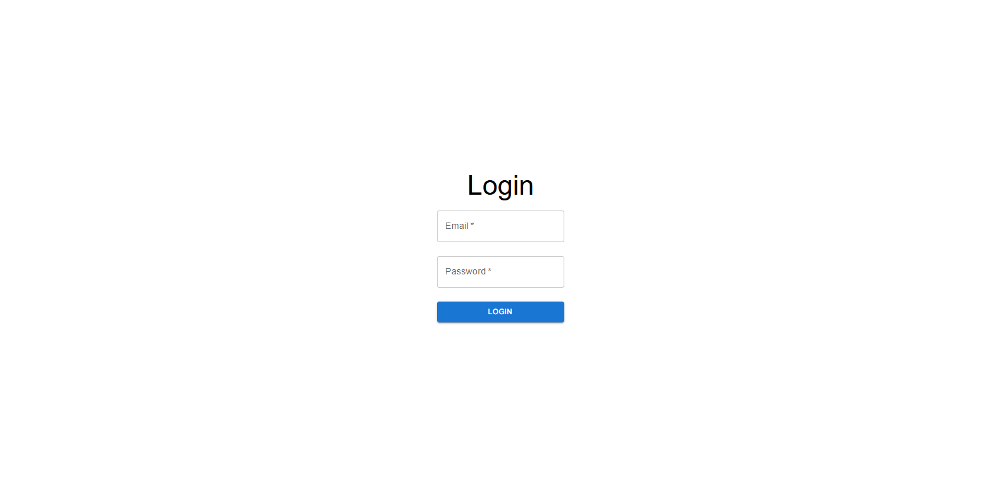

# Biztel-Auth

Authentication Application

First setup basic frontend and backend

## Frontend Setup

```bash
npm create vite@latest
```

Then follow the instructions given in terminal

## Frontend Structure

```bash
src/
├── pages/
│   ├── Home.jsx
│   ├── Login.jsx
│   └── Signup.jsx
├── services/
│   └── api.js
├── layouts/
│   └── MainLayout.jsx
├── components/
│   └── Error.jsx
├── main.jsx
```

## Frontend Libraries

Install the following libraries using npm i for the project setup

for routing

```bash
npm install react-router-dom
```

for styled components use material-ui

```bash
npm install @mui/material @emotion/react @emotion/styled
```

## main.jsx setup

Import react-router-dom and required pages for routing and create a proper routing

```bash
import { StrictMode } from "react";
import { createRoot } from "react-dom/client";
import "./index.css";
import { createBrowserRouter, RouterProvider } from "react-router-dom";
import Home from "./pages/Home.jsx";
import Login from "./pages/Login.jsx";
import Signup from "./pages/Signup.jsx";
import Mainlayout from "./Layouts/MainLayout.jsx";

const router = createBrowserRouter([
  {
    element: <Mainlayout />,
    children: [
      {
        path: "/",
        element: <Home />,
      },
      {
        path: "/login",
        element: <Login />,
      },
      {
        path: "/signup",
        element: <Signup />,
      },
    ],
  },
]);

createRoot(document.getElementById("root")).render(
  <StrictMode>
    <RouterProvider router={router} />
  </StrictMode>
);
```

## MainLayout

/src/layouts/MainLayout.jsx

Setup the MainLayout from where we can navigate to different section we use <Outlet> from react-router-dom to have all the pages in it

```bash
import { Outlet } from 'react-router-dom'

const Mainlayout = () => {
  return (
    <div>
      <Outlet/>
    </div>
  )
}

export default Mainlayout
```

## Home Page Setup

src/pages/Home.jsx

Use <Link> from react-router-dom to navigate to Login and Signup and <Button> from @mui/material for using styled Button

```bash
import { Button } from "@mui/material";
import { Link } from "react-router-dom";

const Home = () => {
  return (
    <div className="home">
      <Link to="/signup" className="nav">
        <Button variant="contained" size="large">
          Sign Up
        </Button>
      </Link>
      <Link to="/login" className="nav">
        <Button variant="contained" size="large" >
          Login
        </Button>
      </Link>
    </div>
  );
};

export default Home;
```


## Signup Page Setup

src/pages/Signup.jsx

Create a basic singup page using mui components of <Grid2>, <Typography>, <Button>, <TextField> from material ui

Use state to handle changes and fill the input fields, check for error and success

Declare changeHandler and submitHandler to handle changes in input fields and reflect them on screen and submitHandler will simply submit the changes produced to backend

```bash
import { Grid2, Typography, Button, TextField } from "@mui/material";
import { signup } from "../services/api";
import { useState } from "react";
import Error from "../components/Error";

const Signup = () => {
  const [formData, setFormData] = useState({
    username: "",
    email: "",
    password: "",
    confirmPassword: "",
    inviteCode: "",
  });

  const [error, setError] = useState("");
  const [success, setSuccess] = useState("");

  const changeHandler = (e) => {
    setFormData({ ...formData, [e.target.name]: e.target.value });
  };

  const submitHandler = async (event) => {
    event.preventDefault();

    if (formData.password !== formData.confirmPassword) {
      setError("Passwords does not match");
      return;
    }

    try {
      setError("");
      await signup(formData);
      setSuccess("Signup successful! You can now log in.");
    } catch (err) {
      setError(err.errorMessage || "An error occurred during signup.");
    }
  };

  return (
    <div className="formDiv">
      <Typography variant="h3" component="h2" gutterBottom>
        Sign Up
      </Typography>
      <form onSubmit={submitHandler}>
        <Grid2 container direction='column' spacing={{ xs: 2, md: 3 }} columnSpacing={{ xs: 1, sm: 2, md: 3 }} size="auto">
          {[
            "username",
            "email",
            "password",
            "confirmPassword",
            "inviteCode",
          ].map((field, idx) => (
            <Grid2 item xs={12} key={idx}>
              <TextField
                fullWidth
                label={field}
                type={field.includes("password") ? "password" : "text"}
                name={field}
                value={formData[field]}
                onChange={changeHandler}
                required
              />
            </Grid2>
          ))}
          <Grid2 item xs={12}>
            <Button variant="contained" color="primary" type="submit" fullWidth>
              Sign Up
            </Button>
          </Grid2>
        </Grid2>
        {error && <Error message={error} />}
        {success && <Typography color="green">{success}</Typography>}
      </form>
    </div>
  );
};

export default Signup;
```


## Login Page Setup

src/pages/Login.jsx

Create a basic singup page using mui components of <Grid2>, <Typography>, <Button>, <TextField> from material ui

Use state to handle changes and fill the input fields, check for incoming messages of success and error

Declare changeHandler and submitHandler to handle changes in input fields and reflect them on screen and submitHandler will simply submit the changes produced to backend

```bash
import { Typography, Grid2, TextField, Button} from "@mui/material";
import { login } from "../services/api";
import { useState } from "react";

const Login = () => {

  const [formData, setFormData] = useState({
    email: "",
    password: "",
  });

  const [message, setMessage] = useState({ type: "", text: "" });

  const changeHandler = (event) => {
    const { name, value } = event.target;
    setFormData((prevData) => ({ ...prevData, [name]: value }));
  };

  const submitHandler = async (event) => {
    event.preventDefault();

    try {
      setMessage({ type: "", text: "" });
      const response = await login(formData);
      setMessage({ type: "success", text: `Welcome, ${response.username}!` });
    } catch (error) {
      setMessage({ type: "error", text: error.errorMessage || "Invalid login credentials." });
    }
  };

  return (
    <div className="formDiv">
      <Typography variant="h3" component='h2' gutterBottom>
        Login
      </Typography>
      <form onSubmit={submitHandler}>
        <Grid2 container direction='column' spacing={{ xs: 2, md: 3 }} columnSpacing={{ xs: 1, sm: 2, md: 3 }} size="auto">
          <Grid2 item xs={12}>
            <TextField
              fullWidth
              label="Email"
              type="email"
              name="email"
              value={formData.email}
              onChange={changeHandler}
              required
            />
          </Grid2>
          <Grid2 item xs={12} >
            <TextField
              fullWidth
              label="Password"
              type="password"
              name="password"
              value={formData.password}
              onChange={changeHandler}
              required
            />
          </Grid2>
          <Grid2 item xs={12}>
            <Button type="submit" variant="contained" color="primary" fullWidth>
              Login
            </Button>
          </Grid2>
        </Grid2>
      </form>
      {message.text && (
        <Typography
          mt={2}
          color={message.type === "error" ? "error" : "primary"}
        >
          {message.text}
        </Typography>
      )}
    </div>
  );
};

export default Login;

```



## Error Component Setup

src/components/Error.jsx

```bash
const Error = ({ message }) => {
    return message ? <div style={{ color: "red", marginTop: "10px" }}>{message}</div> : null;
  };

  export default Error;

```

## Frontend API Call Setup

src/services/api.js

In this we setup basic api call where we setup a basic url and then fetch the backend using axios library

For installing axios

```bash
npm install axios
```

Calling Backedn API -

```bash
import axios from "axios";

const API_BASE_URL = "http://localhost:8080/api/auth";

export const signup = async (data) => {
  try {
    const response = await axios.post(`${API_BASE_URL}/signup`, data);
    return response.data;
  } catch (error) {
    throw error.response?.data || { errorMessage: "Unknown error occurred." };
  }
};

export const login = async (data) => {
  try {
    const response = await axios.post(`${API_BASE_URL}/login`, data);
    return response.data;
  } catch (error) {
    throw error.response?.data || { errorMessage: "Unknown error occurred." };
  }
};

```

## Basic Backend Setup

```bash

server/
├── server.js
```

Installing libraries express, cors, body-parser, YAML, swagger-ui-express

cors- for enabling cross server data transfer
body parser - to parse the incoming json format data
swagger-ui-express- for our yaml backend data file and setting up openAPI environment

```bash

npm install express cors body-parser YAML swagger-ui-express

```
Import all the required libraries in our code

```bash

import express from "express";
import bodyParser from "body-parser";
import {cors} from 'cors'
import YAML from "yamljs";
import { serve, setup } from "swagger-ui-express";
```
Setup these libraries to use the app properly

```bash
app.use(cors());
app.use(bodyParser.json());

const openApiDocument = YAML.load("./openapi_assignment.yaml");
app.use("/api-docs", serve, setup(openApiDocument));
```
Setup of the basic api post call method to submit the signup data

```bash

app.post("/api/auth/signup", (req, res) => {
  const { username, email, password, inviteCode } = req.body;

  if (!username || !email || !password || !inviteCode) {
    return res.status(400).json({ errorMessage: "All fields are required." });
  }

  if (users.some((user) => user.email === email)) {
    return res.status(400).json({ errorMessage: "Email already exists." });
  }

  users.push({ username, email, password });
  return res.status(200).json({ message: "Signup successful!" });
});
```

Setup of the basic api post call method to submit the login data and find if the user is singup or not

```bash

app.post("/api/auth/login", (req, res) => {
  const { email, password } = req.body;

  if (!email || !password) {
    return res.status(400).json({ errorMessage: "Email and password are required." });
  }

  const user = users.find((user) => user.email === email && user.password === password);

  if (!user) {
    return res.status(401).json({ errorMessage: "Invalid credentials." });
  }

  const token = `fake-jwt-token-for-${user.username}`;
  return res.status(200).json({ token, username: user.username });
});
```
